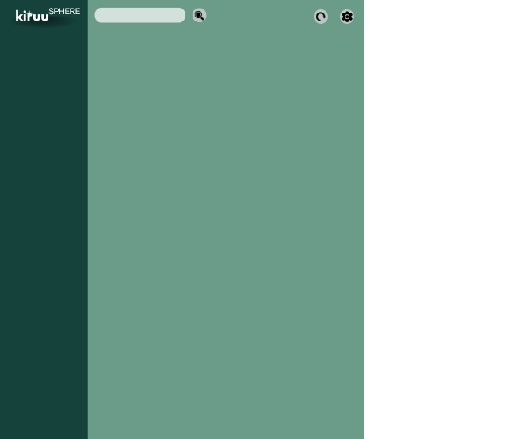

### Project will be started after fixing major bugs from the Currency Exchange JavaX Swing Project

## To-be-implemented:
* The project will be using [Open-Meteo Weather API](https://open-meteo.com/)
* Uses real-time weather API to track various weather conditions, future predictions, air quality (optional).
* [Optional] Users will be able to save their favorite location, and will be shown by default when the application starts (implement using Absolute Layout)

## Sample Design

